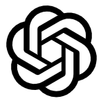

    <h1>
        Image Manipulation Cookbook
    </h1>

<!-- Social -->
<table width="100%" align="center">
    <tr>
        <td align="center">
            <a href="dalle2/README.md">
            <strong>Dalle 2</strong>
             
             
            
 

            </a>
        </td>
        <td align="center">
            <strong>MidJourney (cooming soon)</strong>
             
             
            

        </td>
    </tr>
</table>

<!-- Details -->

    <h1>
        Notes
    </h1>
    

        In this cookbook, I will explore a bunch of parameters and hacks to generate and manipulate images using Dalle 2 and/or MidJourney.
    

