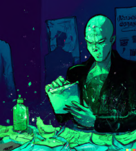

<h1 align="center"> General Vibes </h1>

 
 

<h1 align="left"> Emotional Prompt Words </h1>

    <table>
        <thead>
            <td>
                <b>Positive mood, low energy 😌</b>
            </td>
            <td>
                <b>Positive mood, high energy 🤪</b>
            </td>
        </thead>
        <tr>
            <td>
                
                

                    light, peaceful, calm, serene,  
                    soothing, relaxed, placid,  
                    comforting, cosy, tranquil, quiet,  
                    pastel, delicate, graceful, subtle,  
                    balmy, mild, ethereal, elegant,  
                    tender, soft, light
                

            </td>
            <td>
                
                

                    bright, vibrant, dynamic, spirited,  
                    vivid, lively, energetic, colorful,  
                    joyful, romantic, expressive,  
                    bright, rich, kaleidoscopic,  
                    psychedelic, saturated, ecstatic,  
                    brash, exciting, passionate, hot
                

            </td>
        </tr>
    </table>
    <table>
        <thead>
            <td>
                <b>Negative mood, low energy 😢</b>
            </td>
            <td>
                <b>Negative mood, high energy 😱</b>
            </td>
        </thead>
        <tr>
            <td>
                
                

                    muted, bleak, funereal, somber,  
                    melancholic, mournful, gloomy,  
                    dismal, sad, pale, washed-out,  
                    desaturated, grey, subdued, dull,  
                    dreary, depressing, weary, tired
                

            </td>
            <td>
                
                

                    dark, ominous, threatening,  
                    haunting, forbidding, gloomy,  
                    stormy, doom, apocalyptic,  
                    sinister, shadowy, ghostly,  
                    unnerving, harrowing, dreadful,  
                    frightful, shocking, terror,  
                    hideous, ghastly, terrifying
                

            </td>
        </tr>
    </table>

 
 

<h1 align="left"> Size-y, structure-y words </h1>

    <table>
        <thead>
            <td>
                <b>Big and free</b>
            </td>
            <td>
                <b>Big and structured</b>
            </td>
        </thead>
        <tr>
            <td>
                
                

                    Curvaceous, swirling, organic,  
                    riotous, turbulent, flowing,  
                    amorphous, natural, distorted,  
                    uneven, random, lush, organic,  
                    bold, intuitive, emotive, chaotic,  
                    tumultuous, earthy, churning
                

            </td>
            <td>
                
                

                    Monumental, imposing, rigorous,  
                    geometric, ordered, angular,  
                    artificial, lines, straight, rhythmic,  
                    composed, unified, manmade,  
                    perspective, minimalist, blocks,   
                    dignified, robust, defined
                

            </td>
        </tr>
    </table>
    <table>
        <thead>
            <td>
                <b>Small and structured</b>
            </td>
            <td>
                <b>Small and free</b>
            </td>
        </thead>
        <tr>
            <td>
                
                

                    Ornate, delicate, neat, precise,  
                    detailed, opulent, lavish, elegant,  
                    ornamented, fine, elaborate,  
                    accurate, intricate, meticulous,  
                    decorative, realistic
                

            </td>
            <td>
                
                

                    Unplanned, daring, brash,  
                    random, casual, sketched,  
                    playful, spontaneous,  
                    extemporaneous, offhand,  
                    improvisational, experimental,  
                    loose, jaunty, light, expressive
                

            </td>
        </tr>
    </table>

 
 

<h1 align="left"> Looks, vibes, -punks, -waves </h1>

    <table>
        <thead>
            <td>
                <b>Vaporwave</b>
            </td>
            <td>
                <b>Post-apocalyptic</b>
            </td>
        </thead>
        <tr>
            <td>
                
                

                     neon, pink, blue,  
                    geometric, futuristic, '80s
                

            </td>
            <td>
                
                

                    grey, desolate,  
                    stormy, fire, decay
                

            </td>
        </tr>
    </table>
    <table>
        <thead>
            <td>
                <b>Memphis</b>
            </td>
            <td>
                <b>Dieselpunk</b>
            </td>
        </thead>
        <tr>
            <td>
                
                

                     Memphis Group, 1980s,  
                    bold, kitch, colourful, shapes
                

            </td>
            <td>
                
                

                    grimy, steel, oil, '50s,  
                    mechanised, punk cousin of steampunk
                

            </td>
        </tr>
    </table>
    <table>
        <thead>
            <td>
                <b>Gothic, fantasy</b>
            </td>
            <td>
                <b>Cybernetic, sci-fi</b>
            </td>
        </thead>
        <tr>
            <td>
                
                

                    stone, dark, lush,  
                    nature, mist, mystery, angular
                

            </td>
            <td>
                
                

                     glows,  
                    greens, metals, armor, chrome
                

            </td>
        </tr>
    </table>
    <table>
        <thead>
            <td>
                <b>Afrofuturism</b>
            </td>
            <td>
                <b>Cyberpunk</b>
            </td>
        </thead>
        <tr>
            <td>
                
                

                    futuristic, and  
                    African!
                

            </td>
            <td>
                
                

                    1990s, dyed hair,  
                    spiky, graphic elements
                

            </td>
        </tr>
    </table>
    <table>
        <thead>
            <td>
                <b>Steampunk</b>
            </td>
            <td>
                <b>Biopunk, organic</b>
            </td>
        </thead>
        <tr>
            <td>
                
                

                    gold, copper, brass,  
                    Victoriana,
                

            </td>
            <td>
                
                

                    greens,  
                    slimes, plants, futuristic, weird
                

            </td>
        </tr>
    </table>

